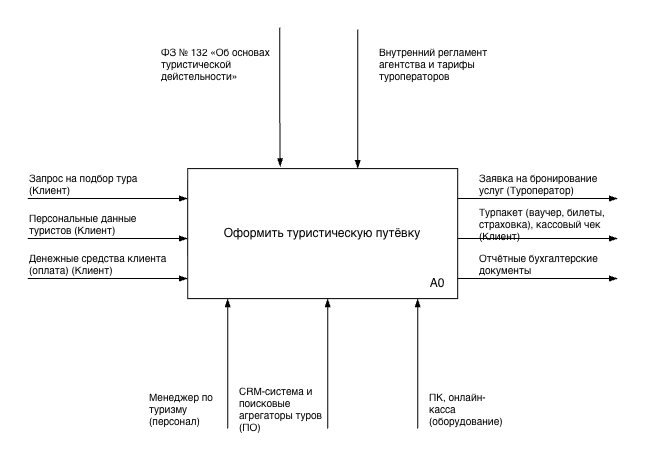
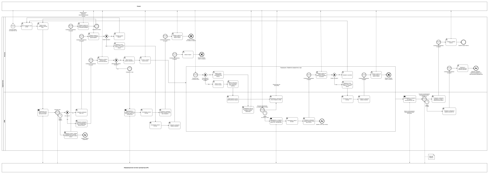

# Итоговая работа: «Моделирование бизнес-процессов»

**Оформление путёвки в туристическом агентстве**

---

## 1. Контекстная диаграмма верхнего уровня (Нотация IDEF0)

---

## 2. Детализированная диаграмма взаимодействия (Нотация BPMN 2.0)

## 3. Предложения по оптимизации и автоматизации процесса

1. **Интеграция с OCR (Автозаполнение данных):** Исключить ручной ввод паспортных данных менеджером в CRM. Внедрить модуль распознавания документов: менеджер прикрепляет фото загранпаспорта, система автоматически распознает текст, валидирует его и заполняет карточку туриста.
2. **API-синхронизация статусов бронирования (Webhooks):** Отказаться от ручного контроля личного кабинета туроператора менеджером («ожидание подтверждения отеля»). Настроить API-обмен: система туроператора сама мгновенно присылает статус бронирования, CRM автоматически меняет статус тура и отправляет клиенту электронные документы без участия менеджера.

